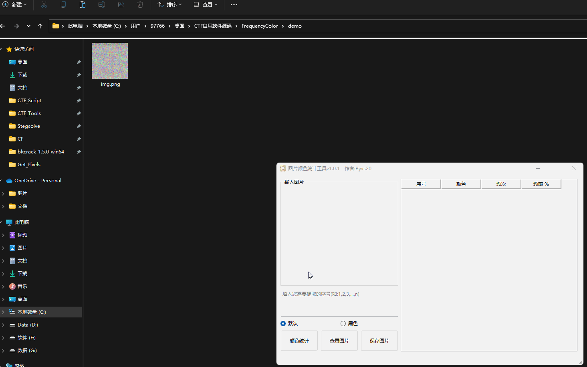

# 注意事项：

[1].默认不适用upx打包，因为使用upx打包后，win11系统打开软件明显缓慢！

[2].使用upx打包教程：

修改 `package.py` 的第4行 `use_upx = False` 改为 `use_upx = True`，第6行的upx目录手动修改为自己的upx目录！

 

# 食用教程

### 1.自行编译

​	1.`python package.py`

​	2.`bin\build`目录就会出现exe程序

### 2.下载我编译成功的

**下载Github发行的Releases，解压即可食用**

 

# 使用效果：

